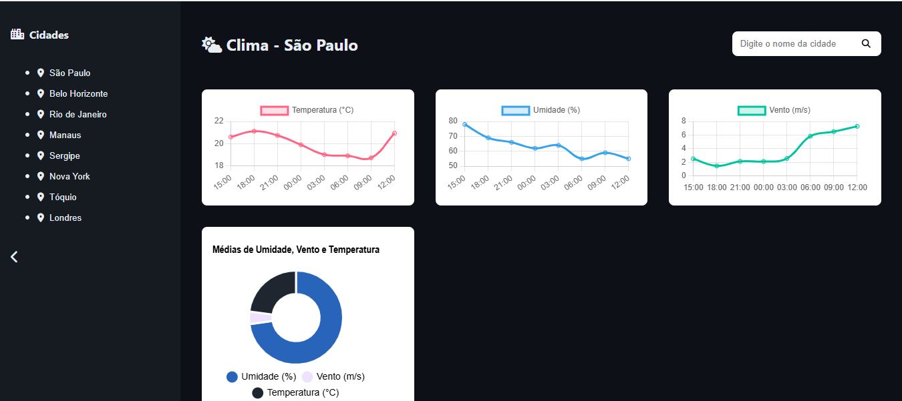

# 🌦️ Weather Dashboard

Este é um projeto de **Dashboard Meteorológica** construído com **React.js** e **Vite**, que consome dados da [API OpenWeatherMap](https://openweathermap.org/api) para exibir informações climáticas de forma visual e intuitiva usando **Chart.js**.


## 📸 Demonstração




## 🚀 Tecnologias Utilizadas

- [React.js](https://reactjs.org/)
- [Vite](https://vitejs.dev/)
- [Chart.js](https://www.chartjs.org/) — para gráficos dinâmicos
- [Font Awesome](https://fontawesome.com/) — para ícones
- [OpenWeatherMap API](https://openweathermap.org/) — dados climáticos
- [CSS3 Customizado](https://developer.mozilla.org/pt-BR/docs/Web/CSS) — sem uso de frameworks de UI como Tailwind ou Bootstrap

## 📊 Funcionalidades

- Pesquisa de cidade e exibição do clima em tempo real
- Gráficos de:
  - Temperatura
  - Umidade
  - Velocidade do vento
  - Média geral em Doughnut
- Clima atual de várias capitais brasileiras em formato de cards
- Scroll horizontal nos cards com botões laterais
- Sidebar colapsável com seleção de cidades
- Layout totalmente responsivo

## 📁 Estrutura do Projeto

```bash
.
├── public/
├── src/
│   ├── components/
│   │   ├── charts/
│   │   │   ├── TemperatureChart.jsx
│   │   │   ├── HumidityChart.jsx
│   │   │   ├── WindChart.jsx
│   │   │   └── DoughnutChart.jsx
│   │   ├── cards/
│   │   │   └── CapitalWeatherCard.jsx
│   │   ├── layout/
│   │   │   ├── Header.jsx
│   │   │   └── Sidebar.jsx
│   │   └── styles/
│   │       ├── variables.css
│   │       ├── layout.css
│   │       └── components.css
│   ├── pages/
│   │   └── Dashboard.jsx
│   ├── services/
│   │   └── weatherService.js
│   └── main.jsx
├── index.html
└── vite.config.js

```

## 🛠️ Como rodar o projeto localmente
Clone o repositório:
```
git clone https://github.com/seu-usuario/weather-dashboard.git
```
```
cd weather-dashboard
```
Instale as dependências:

```
npm install
```
Configure sua chave da OpenWeatherMap:

Crie um arquivo .env na raiz do projeto:

env
```
VITE_OPENWEATHER_API_KEY=sua_chave_aqui
```
Rode o servidor local:
```
npm run dev
```
Build para produção:
```
npm run build
```
## 🌐 Deploy com GitHub Pages
Este projeto pode ser publicado no GitHub Pages com o plugin vite-plugin-gh-pages. Configure o vite.config.js corretamente, definindo base como o nome do repositório:

```
js
export default defineConfig({
  base: "/weather-dashboard/",
  plugins: [react()],
});
```
